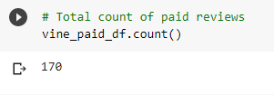
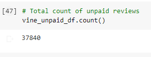
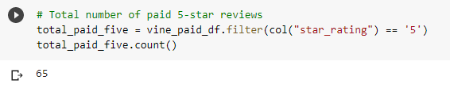
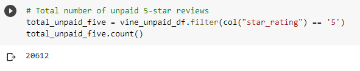
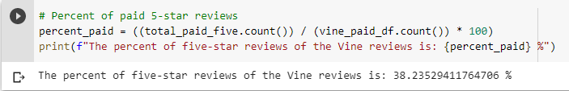
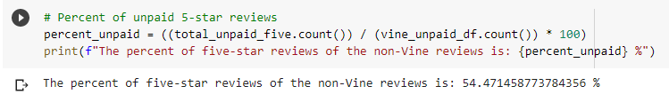

# Amazon Vine Analysis
## Overview of the Analysis
The purpose of this analysis is to determine whether there is any bias in paid (Vine) reviews compared to non-paid (non-Vine) reviews. In doing so, we can decide whether or not to use the Vine program to pay for Amazon reviews.

## Results
- Total Vine vs. Non-Vine Reviews

  - The total number of Vine reviews is 170. 
   
  

  - The total number of non-Vine reviews is 37840. 
  
  

- Total 5-Star Vine Reviews vs. non-Vine Reviews

  - The total number of 5-star Vine reviews is 65. 
  
  

  - The total number of 5-star non-Vine reviews is 20,612. 
  
  

- Percent of 5-Star Reviews for Vine and non-Vine Reviews

  - The percent of Vine reviews with 5-star ratings is 38.24%. 
  
  

  - The percent of non-Vine reviews with 5-star ratings is 54.47%. 
  
  

## Summary
In my analysis, there does not seem to be a positivity bias for Vine reviews. The percentage of Vine reviews with a 5-star rating is 38.24%, which is not overwhelmingly positive. I think paying for Vine reviews could be helpful in getting some positive reviews, but is not necessary to getting a lot of 5-star reviews. Additionally, it seems that the non-Vine reviews were more positive than the Vine reviews, which means that a positivity bias is unlikely. An additional analysis that could be performed is to analyze the 1-star reviews for negativity bias. Another problem could be that if the Vine reviews have a lower percentage of 1-star reveiws compared to the non-Vine reviews, it is likely that Vine reviews are biased towards not leaving a negative review.
